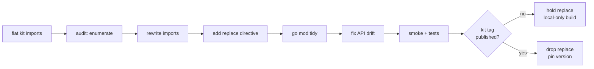

# kit migration playbook

Path: `hop.top/kit/<area>` (flat) → `hop.top/kit/go/<role>/<area>` (role-based).

Generated: 2026-05-01
Author: Jad Bitar
Track: kit-layout-migration (T-0794)
Branch: chore/kit-forward (PR #92)

## Audience

Other labspace consumers (rsx, ctxt, wsm, aps, c12n, etc.) on flat kit paths.
This playbook captures the tlc migration so each consumer skips the same rework.

## Source artifacts

- audit (242 lines, 16 packages, 37 files):
  see [audit-snapshot.md](kit-migration-playbook/audit-snapshot.md)
- coverage matrix: `.tlc/tracks/kit-layout-migration/pr88-coverage-matrix.md`
- canonical commit: `93af64f refactor(deps): roll kit imports forward to go/runtime/* layout`

## Migration shape



Diagram: [migration-flow-v1.mmd](kit-migration-playbook/migration-flow-v1.mmd)

## Path map

Verified against `~/.w/ideacrafterslabs/kit/hops/main/go/`. Identical for all consumers.

| Role | Old (flat) | New (role-based) |
|------|------------|------------------|
| ai | `hop.top/kit/ext` | `hop.top/kit/go/ai/ext` |
| ai | `hop.top/kit/ext/dispatch` | `hop.top/kit/go/ai/ext/dispatch` |
| ai | `hop.top/kit/llm` | `hop.top/kit/go/ai/llm` |
| ai | `hop.top/kit/llm/anthropic` | `hop.top/kit/go/ai/llm/anthropic` |
| ai | `hop.top/kit/llm/errors` | `hop.top/kit/go/ai/llm/errors` |
| ai | `hop.top/kit/llm/ollama` | `hop.top/kit/go/ai/llm/ollama` |
| ai | `hop.top/kit/llm/openai` | `hop.top/kit/go/ai/llm/openai` |
| ai | `hop.top/kit/toolspec` | `hop.top/kit/go/ai/toolspec` |
| console | `hop.top/kit/cli` | `hop.top/kit/go/console/cli` |
| console | `hop.top/kit/log` | `hop.top/kit/go/console/log` |
| console | `hop.top/kit/markdown` | `hop.top/kit/go/console/markdown` |
| console | `hop.top/kit/output` | `hop.top/kit/go/console/output` |
| console | `hop.top/kit/tui` | `hop.top/kit/go/console/tui` |
| core | `hop.top/kit/config` | `hop.top/kit/go/core/config` |
| core | `hop.top/kit/upgrade` | `hop.top/kit/go/core/upgrade` |
| core | `hop.top/kit/upgrade/skill` | `hop.top/kit/go/core/upgrade/skill` |
| core | `hop.top/kit/xdg` | `hop.top/kit/go/core/xdg` |
| runtime | `hop.top/kit/bus` | `hop.top/kit/go/runtime/bus` |
| runtime | `hop.top/kit/domain` | `hop.top/kit/go/runtime/domain` |
| storage | `hop.top/kit/sqlstore` | `hop.top/kit/go/storage/sqlstore` |

No symbol renames. Path-only shift.

## Six-step procedure

### 1. Audit

Pseudocode:

```
xray map --path . --type go
grep -rn 'hop.top/kit/' cmd/ internal/ pkg/ -> audit.md
group by package; assert each lands in path map above
```

Output: per-file table of (path, line, old import). Write to `.tlc/tracks/<track>/audit.md`.

### 2. Rewrite imports

Single sed pass per package mapping. Pseudocode:

```
for each (old_path, new_path) in path_map:
    find . -name '*.go' -exec sed -i '' "s|\"$old_path|\"$new_path|g" {} +
goimports -w .
```

Verify: `git diff --stat` should show only `import` lines changed.

### 3. Replace directive (interim)

Until kit publishes a post-reorg tag, add to `go.mod`:

```
replace hop.top/kit => /Users/jadb/.w/ideacrafterslabs/kit/hops/main
replace hop.top/hdl => /Users/jadb/.w/ideacrafterslabs/hdl/hops/main
```

⚠ The hdl replace is needed if the consumer also uses hdl (kit pulls in hdl symbols
that aren't on hdl's tagged release yet).

### 4. tidy + transitive deps

```
go mod tidy
```

This pulls in transitives kit's new packages need (e.g. `github.com/adrg/xdg` for
`kit/go/core/xdg`). Commit the resulting `go.sum` delta as a separate commit —
makes debugging easier when CI fails.

### 5. Fix API drift

The path shift is mechanical, but kit's NEW layout sometimes re-registers
behavior the consumer was working around. tlc hit two cases:

| Symptom | Root cause | Fix |
|---------|-----------|-----|
| `panic: tlc flag redefined: verbose` on every command | kit/go/console/cli registers `--verbose/-V` as a count flag; consumer's own registration collides | drop the consumer's registration (kit owns it) |
| `flow_executor_test` references removed API | consumer-local test was rewritten on a stale kit; main re-implemented the API | skip the rewrite commit (cherry-pick discipline) |
| `TestUserStateDir_WithoutEnvVar` regression on darwin | kit/go/core/xdg::RawStateDir delegates to adrg/xdg.StateHome which on darwin returns `~/Library/Application Support` (no /state suffix) | local workaround in `internal/config/paths.go` until kit fixes upstream (see kit T-0801 / tlc T-0798) |

### 6. Smoke + tests

Per tlc T-0793, the smoke set is:

```
<bin> init
<bin> task list / create / claim / complete / show
<bin> track list
<bin> --format json task list
<bin> -V task list
<bin> upgrade           # NOT --check (kit T-0996, advertised but not implemented)
```

Plus `go test ./internal/...` excluding pre-existing flakes (in tlc:
`TestTaskShowEva*`, `TestFlowList.*Limit`).

## Gotchas

- **vendor/**: pre-existing `vendor/` dirs from earlier kit pinning will break
  build with stale package layouts. Run `trash vendor` before `go mod tidy`.
  Per labspace policy: never use `go mod vendor`.
- **kit/bus-compat replace**: older branches pinned a `kit/bus-compat` local
  replace. Drop it — the canonical kit replace covers it.
- **--verbose ownership**: pre-reorg kit didn't expose `--verbose`. Consumers
  may have registered their own. Post-reorg kit does. Remove the consumer
  registration; kit's `BindPFlag` lookup still works.
- **upgrade --check**: kit's `upgrade/skill/preamble.go` advertises this flag
  to agents but kit's `upgrade/cli.go::CLIOptions` doesn't implement it (kit
  T-0996). Don't try to register `--check` on the consumer side; wait for
  the kit fix.
- **TestTaskShowEva* hangs**: not migration-induced. Pre-existing on tlc main
  (every branch). DB Close blocks on CreateTask Tx mutex. Track in tlc T-0758
  separately.

## Drop the replace

Gated on kit shipping a post-reorg tag. When that lands:

```
go.mod:
  replace hop.top/kit => …    -> DELETE
  replace hop.top/hdl => …    -> DELETE
require:
  hop.top/kit vX.Y.Z          -> bump
  hop.top/hdl vA.B.C          -> bump
go mod tidy
```

Tracked: tlc T-0795 (this consumer), kit T-0801 (upstream).

## Checklist for next consumer

Pseudocode — adapt to consumer's repo layout:

```
☐ create track in consumer's tlc: `tlc track create "<name>" --type chore`
☐ run xray map → audit.md (file × import matrix)
☐ rewrite imports per path map (single sed pass per package)
☐ add replace directives (kit + hdl if used)
☐ go mod tidy; commit go.sum delta separately
☐ resolve any API drift (likely: --verbose, xdg StateDir)
☐ smoke set (init/list/CRUD/format/verbose)
☐ go test ./… (skip known-flaky if any)
☐ open PR; mark draft until kit tag published
☐ on kit tag: drop replace, pin version, go mod tidy, undraft
```

## Refs

- track: `kit-layout-migration` in this repo
- canonical commit: `93af64f` (this branch)
- upstream parent: kit `0e3135d` "refactor: re-organize repository into role-based hierarchy"
- related kit bugs surfaced: kit T-0996 (`--check`), kit T-0801 (darwin StateDir)
- replaced docs: T-0782 audit (`.tlc/tracks/kit-layout-migration/audit.md`)
